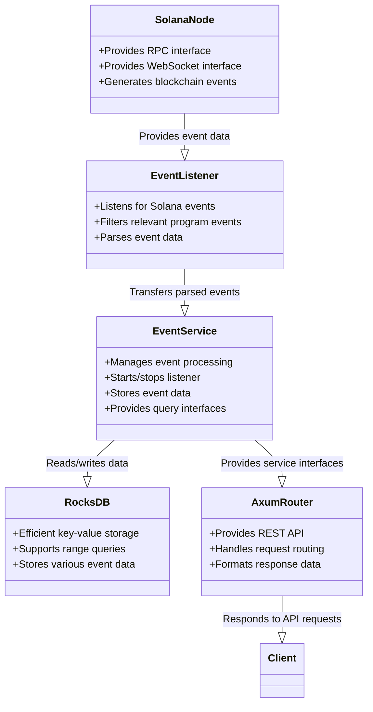
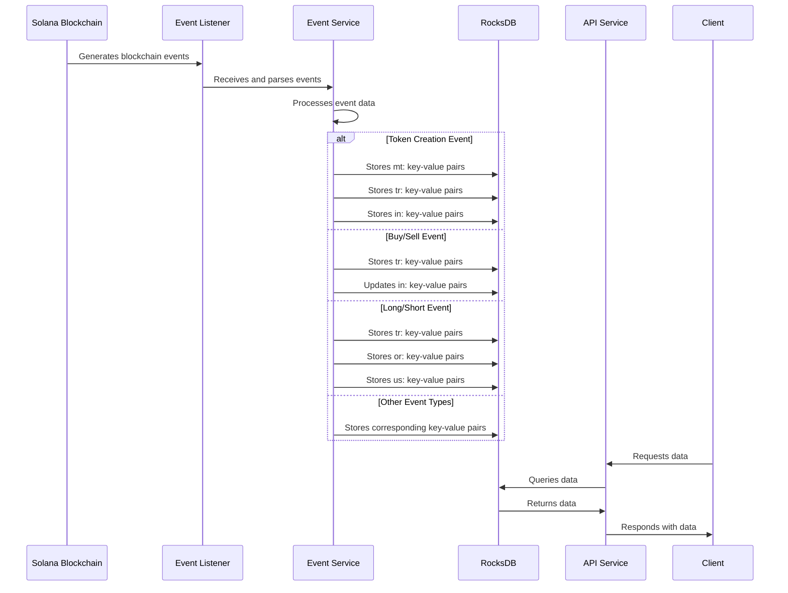
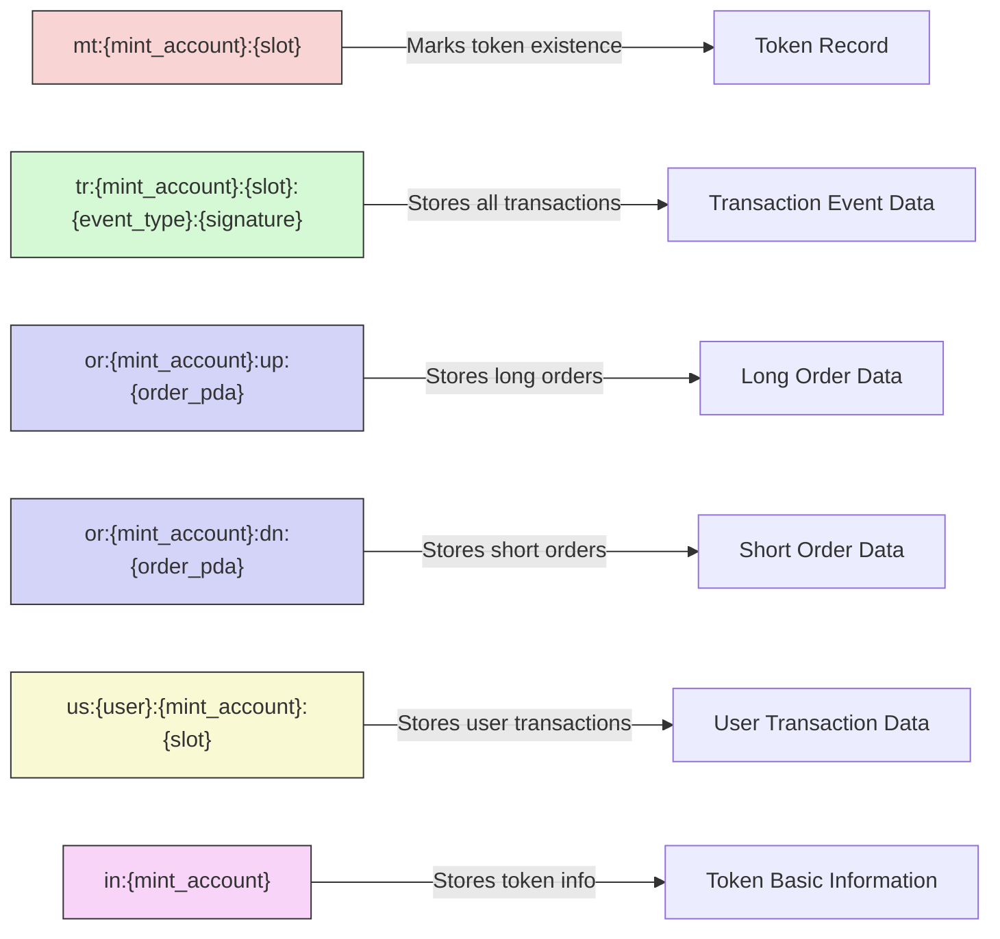

# Spin Server

## Project Overview

Spin Server is a Rust-based server application designed to monitor and process Spin Pet program events on the Solana blockchain, providing related API services. The project integrates Solana blockchain data, uses RocksDB for local data storage, and provides data access interfaces for frontend applications through RESTful APIs.

## Core Features 

- **Solana Event Monitoring**: Real-time monitoring of Spin Pet program events on the Solana blockchain
- **Event Data Storage**: Efficient storage and indexing of blockchain event data using RocksDB
- **RESTful API**: Rich API interfaces supporting queries for events, tokens, orders, and user transactions
- **Swagger Documentation**: Integrated Swagger UI, providing interactive API documentation

## Tech Stack

- **Backend Framework**: Rust + Axum Web framework
- **Data Storage**: RocksDB
- **Blockchain Interaction**: Solana Client SDK
- **API Documentation**: Utoipa (OpenAPI/Swagger)
- **Async Runtime**: Tokio

## Project Architecture

### System Architecture Diagram

```
┌─────────────────┐     ┌─────────────────┐
│                 │     │                 │
│  Solana Node    │◄────┤  Event Listener │
│  (RPC/WebSocket)│     │                 │
│                 │     │                 │
└─────────────────┘     └────────┬────────┘
                                 │
                                 ▼
                        ┌─────────────────┐     ┌─────────────────┐
                        │                 │     │                 │
                        │  Event Service  │────►│   RocksDB       │
                        │                 │     │  (Local Storage)│
                        │                 │     │                 │
                        └────────┬────────┘     └─────────────────┘
                                 │
                                 ▼
                        ┌─────────────────┐
                        │                 │
                        │    API Service  │
                        │   (Axum Router) │
                        │                 │
                        └────────┬────────┘
                                 │
                                 ▼
                        ┌─────────────────┐
                        │                 │
                        │   Client App    │
                        │                 │
                        └─────────────────┘
```

### Component Relationship Diagram



## Event Types

Spin Server monitors and processes the following types of Solana events:

1. **Token Creation Event** (TokenCreated): Records information about new token creation
2. **Buy/Sell Event** (BuySell): Records token trading transactions
3. **Long/Short Event** (LongShort): Records leveraged long or short operations
4. **Force Liquidation Event** (ForceLiquidate): Records when orders are forcibly liquidated
5. **Full Close Event** (FullClose): Records when positions are fully closed
6. **Partial Close Event** (PartialClose): Records when positions are partially closed

### Data Flow Diagram



## Data Storage Structure (RocksDB Key-Value Description)

RocksDB is a high-performance key-value storage engine. This project uses specific key formats to organize and index data:

| Key Prefix | Complete Format | Description |
|------------|----------------|-------------|
| `mt:` | `mt:{mint_account}:{slot}` | Token marker, used to record all existing tokens, internal value is empty |
| `tr:` | `tr:{mint_account}:{slot}:{event_type}:{signature}` | Transaction event data, stores all types of transaction events |
| `or:` | `or:{mint_account}:up:{order_pda}` | Long order data |
| `or:` | `or:{mint_account}:dn:{order_pda}` | Short order data |
| `us:` | `us:{user}:{mint_account}:{slot}` | User transaction events, stores all transaction events related to a user |
| `in:` | `in:{mint_account}` | Token basic information, used for home page listings, recommended listings, etc. |

Where:
- `tr` stands for trade, stores transaction data
- `or` stands for order, stores order data
- `us` stands for user, stores user data
- `in` stands for info, stores token information
- `mt` stands for mint, marks tokens

### Key-Value Storage Structure Diagram



For more detailed key-value explanations, please refer to the [RocksDB键值说明.md](./RocksDB键值说明.md) file.

## API Endpoints

The server provides the following main API endpoints:

- `GET /api/time` - Get current server time
- `GET /api/events/status` - Get event service status
- `GET /api/events/stats` - Get event statistics
- `GET /api/events` - Query event data
- `GET /api/events/db-stats` - Get database statistics
- `GET /api/mints` - Query all tokens
- `POST /api/details` - Query token detailed information
- `GET /api/mint_orders` - Query token order information
- `GET /api/user_event` - Query user transaction events
- `GET /swagger-ui` - API documentation interface

## API Detailed Documentation

### 1. Query Event Data (GET /api/events)

Query all events for a specific token.

#### Request Parameters

| Parameter | Type | Required | Description |
|-----------|------|----------|-------------|
| `mint` | string | Yes | Token account address |
| `page` | number | No | Page number, default is 1 |
| `limit` | number | No | Items per page, default is 50, maximum 1000 |
| `order_by` | string | No | Sort order, values: `slot_asc` (ascending by block number) or `slot_desc` (descending by block number) |

#### Response

```json
{
  "success": true,
  "data": {
    "events": [
      {
        "event_type": "TokenCreated",
        "payer": "3DJDXsrM1mCvzuJMCBJGLAHZRhKz37JaNw7zEMWf1A5G",
        "mint_account": "Fmt6DE83ytByYxQGaKTF3NWGhxoh8rRpTKoBRhBs8ZCg",
        "curve_account": "DvvV21g2zBxGgLnWwe3JgfnKL7YhJJxRQWz24XLRG5jt",
        "name": "Spin Pet Token",
        "symbol": "SPT",
        "uri": "https://example.com/token.json",
        "timestamp": "2023-08-15T12:30:45.123Z",
        "signature": "5xjP8qT7KKbGy9SHVfkTVrEgmMY6BxJ3qxp3MYgmWbZ6...",
        "slot": 123456789
      },
      {
        "event_type": "BuySell",
        "payer": "3DJDXsrM1mCvzuJMCBJGLAHZRhKz37JaNw7zEMWf1A5G",
        "mint_account": "Fmt6DE83ytByYxQGaKTF3NWGhxoh8rRpTKoBRhBs8ZCg",
        "is_buy": true,
        "token_amount": 1000000000,
        "sol_amount": 500000000,
        "latest_price": "500000000000",
        "timestamp": "2023-08-15T12:45:30.456Z",
        "signature": "4qmR3pG5snD1XwA2v1H4TnhL9FdSJx8vZ9bRJ8p8GqCr...",
        "slot": 123456790
      }
      // ... other events
    ],
    "total": 142,
    "page": 1,
    "limit": 50,
    "has_next": true,
    "has_prev": false
  }
}
```

#### Response Fields

| Field | Description |
|-------|-------------|
| `events` | Array of events, each event contains different fields based on its type |
| `total` | Total number of events matching the criteria |
| `page` | Current page number |
| `limit` | Items per page |
| `has_next` | Whether there is a next page |
| `has_prev` | Whether there is a previous page |

#### Event Type Fields

**TokenCreated Event**:
- `payer`: Creator's address
- `mint_account`: Token account address
- `curve_account`: Price curve account
- `name`: Token name
- `symbol`: Token symbol
- `uri`: Token metadata URI
- `timestamp`: Event timestamp
- `signature`: Transaction signature
- `slot`: Block height

**BuySell Event**:
- `payer`: Transaction initiator's address
- `mint_account`: Token account address
- `is_buy`: Whether it's a buy operation
- `token_amount`: Token amount
- `sol_amount`: SOL amount
- `latest_price`: Latest price
- `timestamp`: Event timestamp
- `signature`: Transaction signature
- `slot`: Block height

**LongShort Event**:
- `payer`: Transaction initiator's address
- `mint_account`: Token account address
- `order_pda`: Order PDA address
- `latest_price`: Latest price
- `order_type`: Order type (0=long, 1=short)
- `mint`: Token mint address
- `user`: User address
- `lock_lp_start_price`: Locked LP start price
- `lock_lp_end_price`: Locked LP end price
- `lock_lp_sol_amount`: Locked LP SOL amount
- `lock_lp_token_amount`: Locked LP token amount
- `start_time`: Start time
- `end_time`: End time
- `margin_sol_amount`: Margin SOL amount
- `borrow_amount`: Borrowed amount
- `position_asset_amount`: Position asset amount
- `borrow_fee`: Borrowing fee
- `timestamp`: Event timestamp
- `signature`: Transaction signature
- `slot`: Block height

### 2. Get Database Statistics (GET /api/events/db-stats)

Get statistics for the RocksDB database.

#### Request Parameters

None

#### Response

```json
{
  "success": true,
  "data": "RocksDB Statistics:\n- Total Keys: 15842\n- Estimated Size: 245.3 MB\n- Number of Mints: 32\n- Number of Events: 12456\n- Number of Orders: 128\n- Number of User Transactions: 3226"
}
```

#### Response Fields

Formatted string containing the following statistics:
- `Total Keys`: Total number of keys in the database
- `Estimated Size`: Estimated database size
- `Number of Mints`: Number of tokens
- `Number of Events`: Total number of events
- `Number of Orders`: Total number of orders
- `Number of User Transactions`: Total number of user transactions

### 3. Query All Tokens (GET /api/mints)

Get a list of all tokens in the system.

#### Request Parameters

| Parameter | Type | Required | Description |
|-----------|------|----------|-------------|
| `page` | number | No | Page number, default is 1 |
| `limit` | number | No | Items per page, default is 50, maximum 1000 |

#### Response

```json
{
  "success": true,
  "data": {
    "mints": [
      "Fmt6DE83ytByYxQGaKTF3NWGhxoh8rRpTKoBRhBs8ZCg",
      "2M5dgwGNYHAC3CQVYiriY1DYC4GETDDb3ABWv3qsx3Jr",
      "3TcTZaiCMhCDF2PM7QBzX2aHFeJqLKJrd9LFGLugkr5x",
      // ... other token addresses
    ],
    "total": 32,
    "page": 1,
    "limit": 50,
    "has_next": false,
    "has_prev": false
  }
}
```

#### Response Fields

| Field | Description |
|-------|-------------|
| `mints` | Array of token addresses |
| `total` | Total number of tokens |
| `page` | Current page number |
| `limit` | Items per page |
| `has_next` | Whether there is a next page |
| `has_prev` | Whether there is a previous page |

### 4. Query Token Detailed Information (POST /api/details)

Query detailed information for a list of token addresses.

#### Request Parameters

Request body (JSON):

```json
{
  "mints": [
    "2M5dgwGNYHAC3CQVYiriY1DYC4GETDDb3ABWv3qsx3Jr",
    "3TcTZaiCMhCDF2PM7QBzX2aHFeJqLKJrd9LFGLugkr5x"
  ]
}
```

| Parameter | Type | Required | Description |
|-----------|------|----------|-------------|
| `mints` | string[] | Yes | List of token addresses, maximum 1000 |

#### Response

```json
{
  "success": true,
  "data": {
    "details": [
      {
        "mint_account": "2M5dgwGNYHAC3CQVYiriY1DYC4GETDDb3ABWv3qsx3Jr",
        "payer": "3DJDXsrM1mCvzuJMCBJGLAHZRhKz37JaNw7zEMWf1A5G",
        "curve_account": "DvvV21g2zBxGgLnWwe3JgfnKL7YhJJxRQWz24XLRG5jt",
        "name": "First Token",
        "symbol": "FTK",
        "uri": "https://example.com/token1.json",
        "create_timestamp": 1692105045123,
        "latest_price": "750000000000",
        "latest_trade_time": 1692190845456,
        "total_sol_amount": 12500000000,
        "total_margin_sol_amount": 3500000000,
        "total_force_liquidations": 5,
        "total_close_profit": 850000000
      },
      {
        "mint_account": "3TcTZaiCMhCDF2PM7QBzX2aHFeJqLKJrd9LFGLugkr5x",
        "payer": "6FpBZJcY3mJiV8U8zdQvvBs5QC9EJ2JeieRr1TW4QD6V",
        "curve_account": "G7yur9tT4G3CW1R2hpBz7QMeBBLD6QGJ5ZxhYYDTSZf9",
        "name": "Second Token",
        "symbol": "STK",
        "uri": "https://example.com/token2.json",
        "create_timestamp": 1692108045123,
        "latest_price": "450000000000",
        "latest_trade_time": 1692194845456,
        "total_sol_amount": 8700000000,
        "total_margin_sol_amount": 2100000000,
        "total_force_liquidations": 2,
        "total_close_profit": 320000000
      }
    ],
    "total": 2
  }
}
```

#### Response Fields

| Field | Description |
|-------|-------------|
| `details` | Array of token details |
| `total` | Number of token details returned |

**Token Detail Fields**:
- `mint_account`: Token account address
- `payer`: Creator's address
- `curve_account`: Price curve account
- `name`: Token name
- `symbol`: Token symbol
- `uri`: Token metadata URI
- `create_timestamp`: Creation timestamp (milliseconds)
- `latest_price`: Latest price
- `latest_trade_time`: Latest trade timestamp (milliseconds)
- `total_sol_amount`: Total SOL amount in transactions
- `total_margin_sol_amount`: Total margin SOL amount
- `total_force_liquidations`: Number of forced liquidations
- `total_close_profit`: Total closing profit

### 5. Query Token Order Information (GET /api/mint_orders)

Query order information for a specific token.

#### Request Parameters

| Parameter | Type | Required | Description |
|-----------|------|----------|-------------|
| `mint` | string | Yes | Token account address |
| `type` | string | Yes | Order type, values: `up_orders` (short orders) or `down_orders` (long orders) |

#### Response

```json
{
  "success": true,
  "data": {
    "orders": [
      {
        "order_type": 0,
        "mint": "Fmt6DE83ytByYxQGaKTF3NWGhxoh8rRpTKoBRhBs8ZCg",
        "user": "3DJDXsrM1mCvzuJMCBJGLAHZRhKz37JaNw7zEMWf1A5G",
        "lock_lp_start_price": "500000000000",
        "lock_lp_end_price": "550000000000",
        "lock_lp_sol_amount": 1000000000,
        "lock_lp_token_amount": 2000000000,
        "start_time": 1692105045,
        "end_time": 1692191445,
        "margin_sol_amount": 500000000,
        "borrow_amount": 300000000,
        "position_asset_amount": 600000000,
        "borrow_fee": 100,
        "order_pda": "Hx7J9sJ2U5CX6m7sMpFkz3GTxCq8H2SpKmR9ztGx2j8v"
      },
      // ... other orders
    ],
    "total": 12,
    "order_type": "up_orders",
    "mint_account": "Fmt6DE83ytByYxQGaKTF3NWGhxoh8rRpTKoBRhBs8ZCg"
  }
}
```

#### Response Fields

| Field | Description |
|-------|-------------|
| `orders` | Array of order data |
| `total` | Total number of orders matching the criteria |
| `order_type` | Order type |
| `mint_account` | Token account address |

**Order Data Fields**:
- `order_type`: Order type (0=long, 1=short)
- `mint`: Token mint address
- `user`: User address
- `lock_lp_start_price`: Locked LP start price
- `lock_lp_end_price`: Locked LP end price
- `lock_lp_sol_amount`: Locked LP SOL amount
- `lock_lp_token_amount`: Locked LP token amount
- `start_time`: Start time (Unix timestamp, seconds)
- `end_time`: End time (Unix timestamp, seconds)
- `margin_sol_amount`: Margin SOL amount
- `borrow_amount`: Borrowed amount
- `position_asset_amount`: Position asset amount
- `borrow_fee`: Borrowing fee (in basis points, 1 basis point = 0.01%)
- `order_pda`: Order PDA address

### 6. Query User Transaction Events (GET /api/user_event)

Query transaction events for a specific user.

#### Request Parameters

| Parameter | Type | Required | Description |
|-----------|------|----------|-------------|
| `user` | string | Yes | User address |
| `mint` | string | No | Token address, if specified, only query transactions related to this token |
| `page` | number | No | Page number, default is 1 |
| `limit` | number | No | Items per page, default is 50, maximum 1000 |
| `order_by` | string | No | Sort order, values: `slot_asc` (ascending by block number) or `slot_desc` (descending by block number) |

#### Response

```json
{
  "success": true,
  "data": {
    "transactions": [
      {
        "event_type": "long_short",
        "user": "3DJDXsrM1mCvzuJMCBJGLAHZRhKz37JaNw7zEMWf1A5G",
        "mint_account": "Fmt6DE83ytByYxQGaKTF3NWGhxoh8rRpTKoBRhBs8ZCg",
        "slot": 123456789,
        "timestamp": 1692105045123,
        "signature": "5xjP8qT7KKbGy9SHVfkTVrEgmMY6BxJ3qxp3MYgmWbZ6...",
        "event_data": {
          // Complete event data (same structure as LongShort event)
        }
      },
      {
        "event_type": "full_close",
        "user": "3DJDXsrM1mCvzuJMCBJGLAHZRhKz37JaNw7zEMWf1A5G",
        "mint_account": "Fmt6DE83ytByYxQGaKTF3NWGhxoh8rRpTKoBRhBs8ZCg",
        "slot": 123456790,
        "timestamp": 1692191445456,
        "signature": "4qmR3pG5snD1XwA2v1H4TnhL9FdSJx8vZ9bRJ8p8GqCr...",
        "event_data": {
          // Complete event data (same structure as FullClose event)
        }
      }
      // ... other transaction events
    ],
    "total": 8,
    "page": 1,
    "limit": 50,
    "has_next": false,
    "has_prev": false,
    "user": "3DJDXsrM1mCvzuJMCBJGLAHZRhKz37JaNw7zEMWf1A5G",
    "mint_account": "Fmt6DE83ytByYxQGaKTF3NWGhxoh8rRpTKoBRhBs8ZCg"
  }
}
```

#### Response Fields

| Field | Description |
|-------|-------------|
| `transactions` | Array of user transaction events |
| `total` | Total number of transactions matching the criteria |
| `page` | Current page number |
| `limit` | Items per page |
| `has_next` | Whether there is a next page |
| `has_prev` | Whether there is a previous page |
| `user` | Queried user address |
| `mint_account` | Queried token address (if specified) |

**User Transaction Event Fields**:
- `event_type`: Event type (`long_short`, `force_liquidate`, `full_close`, `partial_close`)
- `user`: User address
- `mint_account`: Token account address
- `slot`: Block height
- `timestamp`: Event timestamp (milliseconds)
- `signature`: Transaction signature
- `event_data`: Complete event data (with different structures based on event type)

## Configuration

Project configuration files are located in the `config/` directory, containing the following main configuration items:

- **Server Configuration**: Host and port settings
- **CORS Configuration**: Cross-Origin Resource Sharing policy
- **Solana Configuration**: RPC URL, WebSocket URL, program ID, etc.
- **Database Configuration**: RocksDB storage path

## How to Start

1. Ensure Rust and Cargo are installed
2. Configure `config/default.toml` or the appropriate environment configuration file
3. Execute the following command to start the server:

```bash
cargo run --release
```

By default, the server will start on `0.0.0.0:8080`, which can be modified through the configuration file.

## Accessing API Documentation

After starting the server, you can access the Swagger UI interface via:

```
http://<host>:<port>/swagger-ui
```

## Development and Debugging

- In development mode, use `cargo run` to start the server
- Check log output to understand event processing status
- Use `test_websocket.js` and `test_mint_details.js` for functionality testing
