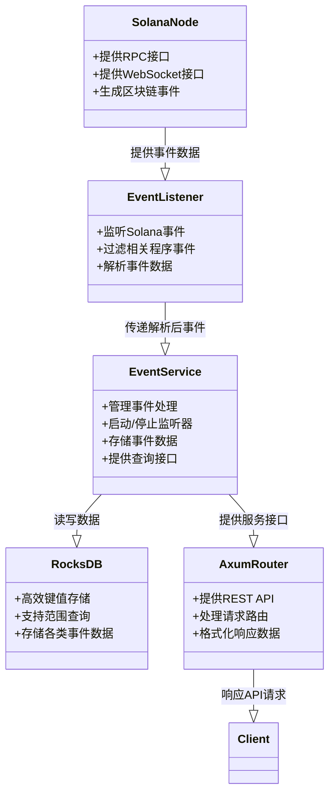
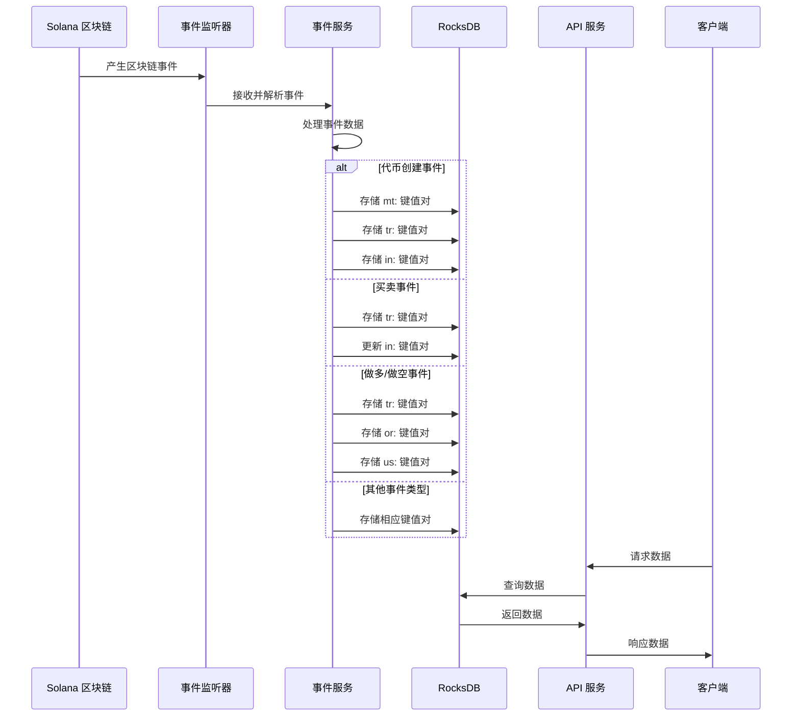
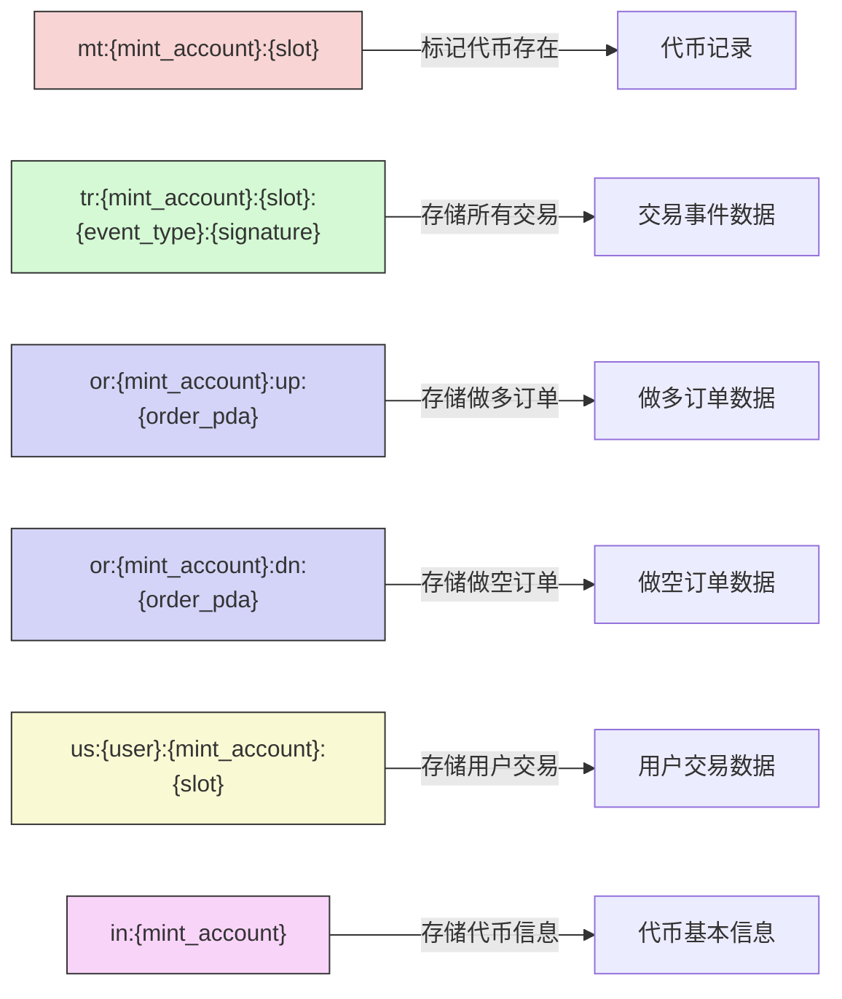

# Spin Server

## 项目概述

Spin Server 是一个基于 Rust 开发的服务端应用程序，主要用于监听和处理 Solana 区块链上的 Spin Pet 程序事件，并提供相关的 API 服务。该项目整合了 Solana 区块链数据，使用 RocksDB 进行本地数据存储，并通过 RESTful API 为前端应用提供数据访问接口。

## 核心功能

- **Solana 事件监听**：实时监控 Solana 区块链上的 Spin Pet 程序事件
- **事件数据存储**：使用 RocksDB 高效存储和索引区块链事件数据
- **RESTful API**：提供丰富的 API 接口，支持查询事件、代币、订单和用户交易数据
- **Swagger 文档**：集成 Swagger UI，提供可交互式的 API 文档

## 技术栈

- **后端框架**：Rust + Axum Web 框架
- **数据存储**：RocksDB
- **区块链交互**：Solana Client SDK
- **API 文档**：Utoipa (OpenAPI/Swagger)
- **异步运行时**：Tokio

## 项目架构

### 系统架构图

```
┌─────────────────┐     ┌─────────────────┐
│                 │     │                 │
│  Solana 节点    │◄────┤  事件监听器      │
│  (RPC/WebSocket)│     │  (EventListener)│
│                 │     │                 │
└─────────────────┘     └────────┬────────┘
                                 │
                                 ▼
                        ┌─────────────────┐     ┌─────────────────┐
                        │                 │     │                 │
                        │  事件服务       │────►│   RocksDB       │
                        │ (EventService)  │     │  (本地存储)      │
                        │                 │     │                 │
                        └────────┬────────┘     └─────────────────┘
                                 │
                                 ▼
                        ┌─────────────────┐
                        │                 │
                        │    API 服务     │
                        │   (Axum Router) │
                        │                 │
                        └────────┬────────┘
                                 │
                                 ▼
                        ┌─────────────────┐
                        │                 │
                        │   客户端应用     │
                        │                 │
                        └─────────────────┘
```

### 组件关系图



## 事件类型

Spin Server 监听和处理以下几种 Solana 事件：

1. **代币创建事件** (TokenCreated)：记录新代币创建的信息
2. **买卖事件** (BuySell)：记录代币买卖交易
3. **做多/做空事件** (LongShort)：记录杠杆做多或做空操作
4. **强制清算事件** (ForceLiquidate)：记录订单被强制清算的事件
5. **完全关闭事件** (FullClose)：记录头寸完全关闭的事件
6. **部分关闭事件** (PartialClose)：记录头寸部分关闭的事件

### 数据流程图



## 数据存储结构 (RocksDB键值说明)

RocksDB 是一个高性能的键值存储引擎，本项目使用特定的键格式来组织和索引数据：

| 键前缀 | 完整格式 | 描述 |
|-------|---------|------|
| `mt:` | `mt:{mint_account}:{slot}` | 代币标记，用于记录所有已存在的代币，内部值为空 |
| `tr:` | `tr:{mint_account}:{slot}:{event_type}:{signature}` | 交易事件数据，存储所有类型的交易事件 |
| `or:` | `or:{mint_account}:up:{order_pda}` | 做多订单数据 |
| `or:` | `or:{mint_account}:dn:{order_pda}` | 做空订单数据 |
| `us:` | `us:{user}:{mint_account}:{slot}` | 用户交易事件，存储用户所有相关的交易事件 |
| `in:` | `in:{mint_account}` | 代币基本信息，用于首页列表、推荐列表等功能 |

其中：
- `tr` 代表 trade，存储交易数据
- `or` 代表 order，存储订单数据
- `us` 代表 user，存储用户数据
- `in` 代表 info，存储代币信息
- `mt` 代表 mint，标记代币

### 键值存储结构图



更详细的键值说明请参考 [RocksDB键值说明.md](./RocksDB键值说明.md) 文件。

## API 端点

服务器提供以下主要 API 端点：

- `GET /api/time` - 获取当前服务器时间
- `GET /api/events/status` - 获取事件服务状态
- `GET /api/events/stats` - 获取事件统计信息
- `GET /api/events` - 查询事件数据
- `GET /api/events/db-stats` - 获取数据库统计信息
- `GET /api/mints` - 查询所有代币
- `POST /api/details` - 查询代币详细信息
- `GET /api/mint_orders` - 查询代币订单信息
- `GET /api/user_event` - 查询用户交易事件
- `GET /swagger-ui` - API 文档界面

## API 详细说明

### 1. 查询事件数据 (GET /api/events)

查询特定代币的所有事件数据。

#### 请求参数

| 参数 | 类型 | 必填 | 描述 |
|-----|------|------|------|
| `mint` | string | 是 | 代币账户地址 |
| `page` | number | 否 | 页码，默认为 1 |
| `limit` | number | 否 | 每页数据量，默认为 50，最大 1000 |
| `order_by` | string | 否 | 排序方式，可选值：`slot_asc`（按区块号升序）或 `slot_desc`（按区块号降序） |

#### 返回值

```json
{
  "success": true,
  "data": {
    "events": [
      {
        "event_type": "TokenCreated",
        "payer": "3DJDXsrM1mCvzuJMCBJGLAHZRhKz37JaNw7zEMWf1A5G",
        "mint_account": "Fmt6DE83ytByYxQGaKTF3NWGhxoh8rRpTKoBRhBs8ZCg",
        "curve_account": "DvvV21g2zBxGgLnWwe3JgfnKL7YhJJxRQWz24XLRG5jt",
        "name": "Spin Pet Token",
        "symbol": "SPT",
        "uri": "https://example.com/token.json",
        "timestamp": "2023-08-15T12:30:45.123Z",
        "signature": "5xjP8qT7KKbGy9SHVfkTVrEgmMY6BxJ3qxp3MYgmWbZ6...",
        "slot": 123456789
      },
      {
        "event_type": "BuySell",
        "payer": "3DJDXsrM1mCvzuJMCBJGLAHZRhKz37JaNw7zEMWf1A5G",
        "mint_account": "Fmt6DE83ytByYxQGaKTF3NWGhxoh8rRpTKoBRhBs8ZCg",
        "is_buy": true,
        "token_amount": 1000000000,
        "sol_amount": 500000000,
        "latest_price": "500000000000",
        "timestamp": "2023-08-15T12:45:30.456Z",
        "signature": "4qmR3pG5snD1XwA2v1H4TnhL9FdSJx8vZ9bRJ8p8GqCr...",
        "slot": 123456790
      }
      // ... 其他事件
    ],
    "total": 142,
    "page": 1,
    "limit": 50,
    "has_next": true,
    "has_prev": false
  }
}
```

#### 返回字段说明

| 字段 | 描述 |
|------|------|
| `events` | 事件数组，每个事件根据类型包含不同字段 |
| `total` | 符合条件的事件总数 |
| `page` | 当前页码 |
| `limit` | 每页数据量 |
| `has_next` | 是否有下一页 |
| `has_prev` | 是否有上一页 |

#### 事件类型字段说明

**TokenCreated 事件**:
- `payer`: 创建者地址
- `mint_account`: 代币账户地址
- `curve_account`: 价格曲线账户
- `name`: 代币名称
- `symbol`: 代币符号
- `uri`: 代币元数据URI
- `timestamp`: 事件时间戳
- `signature`: 交易签名
- `slot`: 区块高度

**BuySell 事件**:
- `payer`: 交易发起者地址
- `mint_account`: 代币账户地址
- `is_buy`: 是否为买入操作
- `token_amount`: 代币数量
- `sol_amount`: SOL数量
- `latest_price`: 最新价格
- `timestamp`: 事件时间戳
- `signature`: 交易签名
- `slot`: 区块高度

**LongShort 事件**:
- `payer`: 交易发起者地址
- `mint_account`: 代币账户地址
- `order_pda`: 订单PDA地址
- `latest_price`: 最新价格
- `order_type`: 订单类型（0=做多，1=做空）
- `mint`: 代币铸造地址
- `user`: 用户地址
- `lock_lp_start_price`: 锁定LP起始价格
- `lock_lp_end_price`: 锁定LP结束价格
- `lock_lp_sol_amount`: 锁定LP的SOL数量
- `lock_lp_token_amount`: 锁定LP的代币数量
- `start_time`: 开始时间
- `end_time`: 结束时间
- `margin_sol_amount`: 保证金SOL数量
- `borrow_amount`: 借入数量
- `position_asset_amount`: 仓位资产数量
- `borrow_fee`: 借款费用
- `timestamp`: 事件时间戳
- `signature`: 交易签名
- `slot`: 区块高度

### 2. 获取数据库统计信息 (GET /api/events/db-stats)

获取RocksDB数据库的统计信息。

#### 请求参数

无

#### 返回值

```json
{
  "success": true,
  "data": "RocksDB Statistics:\n- Total Keys: 15842\n- Estimated Size: 245.3 MB\n- Number of Mints: 32\n- Number of Events: 12456\n- Number of Orders: 128\n- Number of User Transactions: 3226"
}
```

#### 返回字段说明

格式化的字符串，包含以下统计信息：
- `Total Keys`: 数据库中的总键数
- `Estimated Size`: 估计的数据库大小
- `Number of Mints`: 代币数量
- `Number of Events`: 事件总数
- `Number of Orders`: 订单总数
- `Number of User Transactions`: 用户交易总数

### 3. 查询所有代币 (GET /api/mints)

获取系统中所有代币的列表。

#### 请求参数

| 参数 | 类型 | 必填 | 描述 |
|-----|------|------|------|
| `page` | number | 否 | 页码，默认为 1 |
| `limit` | number | 否 | 每页数据量，默认为 50，最大 1000 |

#### 返回值

```json
{
  "success": true,
  "data": {
    "mints": [
      "Fmt6DE83ytByYxQGaKTF3NWGhxoh8rRpTKoBRhBs8ZCg",
      "2M5dgwGNYHAC3CQVYiriY1DYC4GETDDb3ABWv3qsx3Jr",
      "3TcTZaiCMhCDF2PM7QBzX2aHFeJqLKJrd9LFGLugkr5x",
      // ... 其他代币地址
    ],
    "total": 32,
    "page": 1,
    "limit": 50,
    "has_next": false,
    "has_prev": false
  }
}
```

#### 返回字段说明

| 字段 | 描述 |
|------|------|
| `mints` | 代币地址数组 |
| `total` | 代币总数 |
| `page` | 当前页码 |
| `limit` | 每页数据量 |
| `has_next` | 是否有下一页 |
| `has_prev` | 是否有上一页 |

### 4. 查询代币详细信息 (POST /api/details)

根据代币地址列表查询代币的详细信息。

#### 请求参数

请求体 (JSON):

```json
{
  "mints": [
    "2M5dgwGNYHAC3CQVYiriY1DYC4GETDDb3ABWv3qsx3Jr",
    "3TcTZaiCMhCDF2PM7QBzX2aHFeJqLKJrd9LFGLugkr5x"
  ]
}
```

| 参数 | 类型 | 必填 | 描述 |
|-----|------|------|------|
| `mints` | string[] | 是 | 代币地址列表，最多 1000 个 |

#### 返回值

```json
{
  "success": true,
  "data": {
    "details": [
      {
        "mint_account": "2M5dgwGNYHAC3CQVYiriY1DYC4GETDDb3ABWv3qsx3Jr",
        "payer": "3DJDXsrM1mCvzuJMCBJGLAHZRhKz37JaNw7zEMWf1A5G",
        "curve_account": "DvvV21g2zBxGgLnWwe3JgfnKL7YhJJxRQWz24XLRG5jt",
        "name": "First Token",
        "symbol": "FTK",
        "uri": "https://example.com/token1.json",
        "create_timestamp": 1692105045123,
        "latest_price": "750000000000",
        "latest_trade_time": 1692190845456,
        "total_sol_amount": 12500000000,
        "total_margin_sol_amount": 3500000000,
        "total_force_liquidations": 5,
        "total_close_profit": 850000000
      },
      {
        "mint_account": "3TcTZaiCMhCDF2PM7QBzX2aHFeJqLKJrd9LFGLugkr5x",
        "payer": "6FpBZJcY3mJiV8U8zdQvvBs5QC9EJ2JeieRr1TW4QD6V",
        "curve_account": "G7yur9tT4G3CW1R2hpBz7QMeBBLD6QGJ5ZxhYYDTSZf9",
        "name": "Second Token",
        "symbol": "STK",
        "uri": "https://example.com/token2.json",
        "create_timestamp": 1692108045123,
        "latest_price": "450000000000",
        "latest_trade_time": 1692194845456,
        "total_sol_amount": 8700000000,
        "total_margin_sol_amount": 2100000000,
        "total_force_liquidations": 2,
        "total_close_profit": 320000000
      }
    ],
    "total": 2
  }
}
```

#### 返回字段说明

| 字段 | 描述 |
|------|------|
| `details` | 代币详情数组 |
| `total` | 返回的代币详情数量 |

**代币详情字段**:
- `mint_account`: 代币账户地址
- `payer`: 创建者地址
- `curve_account`: 价格曲线账户
- `name`: 代币名称
- `symbol`: 代币符号
- `uri`: 代币元数据URI
- `create_timestamp`: 创建时间戳 (毫秒)
- `latest_price`: 最新价格
- `latest_trade_time`: 最新交易时间戳 (毫秒)
- `total_sol_amount`: 总交易SOL数量
- `total_margin_sol_amount`: 总保证金SOL数量
- `total_force_liquidations`: 强制清算次数
- `total_close_profit`: 总平仓利润

### 5. 查询代币订单信息 (GET /api/mint_orders)

查询特定代币的订单信息。

#### 请求参数

| 参数 | 类型 | 必填 | 描述 |
|-----|------|------|------|
| `mint` | string | 是 | 代币账户地址 |
| `type` | string | 是 | 订单类型，可选值：`up_orders`（做空订单）或 `down_orders`（做多订单） |

#### 返回值

```json
{
  "success": true,
  "data": {
    "orders": [
      {
        "order_type": 0,
        "mint": "Fmt6DE83ytByYxQGaKTF3NWGhxoh8rRpTKoBRhBs8ZCg",
        "user": "3DJDXsrM1mCvzuJMCBJGLAHZRhKz37JaNw7zEMWf1A5G",
        "lock_lp_start_price": "500000000000",
        "lock_lp_end_price": "550000000000",
        "lock_lp_sol_amount": 1000000000,
        "lock_lp_token_amount": 2000000000,
        "start_time": 1692105045,
        "end_time": 1692191445,
        "margin_sol_amount": 500000000,
        "borrow_amount": 300000000,
        "position_asset_amount": 600000000,
        "borrow_fee": 100,
        "order_pda": "Hx7J9sJ2U5CX6m7sMpFkz3GTxCq8H2SpKmR9ztGx2j8v"
      },
      // ... 其他订单
    ],
    "total": 12,
    "order_type": "up_orders",
    "mint_account": "Fmt6DE83ytByYxQGaKTF3NWGhxoh8rRpTKoBRhBs8ZCg"
  }
}
```

#### 返回字段说明 

| 字段 | 描述 |
|------|------|
| `orders` | 订单数据数组 |
| `total` | 符合条件的订单总数 |
| `order_type` | 订单类型 |
| `mint_account` | 代币账户地址 |

**订单数据字段**:
- `order_type`: 订单类型（0=做多，1=做空）
- `mint`: 代币铸造地址
- `user`: 用户地址
- `lock_lp_start_price`: 锁定LP起始价格
- `lock_lp_end_price`: 锁定LP结束价格
- `lock_lp_sol_amount`: 锁定LP的SOL数量
- `lock_lp_token_amount`: 锁定LP的代币数量
- `start_time`: 开始时间 (Unix时间戳，秒)
- `end_time`: 结束时间 (Unix时间戳，秒)
- `margin_sol_amount`: 保证金SOL数量
- `borrow_amount`: 借入数量
- `position_asset_amount`: 仓位资产数量
- `borrow_fee`: 借款费用 (基点，1个基点 = 0.01%)
- `order_pda`: 订单PDA地址

### 6. 查询用户交易事件 (GET /api/user_event)

查询特定用户的交易事件。

#### 请求参数

| 参数 | 类型 | 必填 | 描述 |
|-----|------|------|------|
| `user` | string | 是 | 用户地址 |
| `mint` | string | 否 | 代币地址，如果指定则只查询与该代币相关的交易 |
| `page` | number | 否 | 页码，默认为 1 |
| `limit` | number | 否 | 每页数据量，默认为 50，最大 1000 |
| `order_by` | string | 否 | 排序方式，可选值：`slot_asc`（按区块号升序）或 `slot_desc`（按区块号降序） |

#### 返回值

```json
{
  "success": true,
  "data": {
    "transactions": [
      {
        "event_type": "long_short",
        "user": "3DJDXsrM1mCvzuJMCBJGLAHZRhKz37JaNw7zEMWf1A5G",
        "mint_account": "Fmt6DE83ytByYxQGaKTF3NWGhxoh8rRpTKoBRhBs8ZCg",
        "slot": 123456789,
        "timestamp": 1692105045123,
        "signature": "5xjP8qT7KKbGy9SHVfkTVrEgmMY6BxJ3qxp3MYgmWbZ6...",
        "event_data": {
          // 完整事件数据（与LongShort事件数据结构相同）
        }
      },
      {
        "event_type": "full_close",
        "user": "3DJDXsrM1mCvzuJMCBJGLAHZRhKz37JaNw7zEMWf1A5G",
        "mint_account": "Fmt6DE83ytByYxQGaKTF3NWGhxoh8rRpTKoBRhBs8ZCg",
        "slot": 123456790,
        "timestamp": 1692191445456,
        "signature": "4qmR3pG5snD1XwA2v1H4TnhL9FdSJx8vZ9bRJ8p8GqCr...",
        "event_data": {
          // 完整事件数据（与FullClose事件数据结构相同）
        }
      }
      // ... 其他交易事件
    ],
    "total": 8,
    "page": 1,
    "limit": 50,
    "has_next": false,
    "has_prev": false,
    "user": "3DJDXsrM1mCvzuJMCBJGLAHZRhKz37JaNw7zEMWf1A5G",
    "mint_account": "Fmt6DE83ytByYxQGaKTF3NWGhxoh8rRpTKoBRhBs8ZCg"
  }
}
```

#### 返回字段说明

| 字段 | 描述 |
|------|------|
| `transactions` | 用户交易事件数组 |
| `total` | 符合条件的交易总数 |
| `page` | 当前页码 |
| `limit` | 每页数据量 |
| `has_next` | 是否有下一页 |
| `has_prev` | 是否有上一页 |
| `user` | 查询的用户地址 |
| `mint_account` | 查询的代币地址（如果有指定） |

**用户交易事件字段**:
- `event_type`: 事件类型（`long_short`, `force_liquidate`, `full_close`, `partial_close`） 
- `user`: 用户地址
- `mint_account`: 代币账户地址
- `slot`: 区块高度
- `timestamp`: 事件时间戳 (毫秒)
- `signature`: 交易签名
- `event_data`: 完整事件数据（根据事件类型有不同的结构）

## 配置说明

项目配置文件位于 `config/` 目录，包含以下主要配置项：

- **服务器配置**：主机和端口设置
- **CORS 配置**：跨域资源共享策略
- **Solana 配置**：RPC URL、WebSocket URL、程序 ID 等
- **数据库配置**：RocksDB 存储路径

## 如何启动

1. 确保安装了 Rust 和 Cargo
2. 配置 `config/default.toml` 或相应环境的配置文件
3. 执行以下命令启动服务器：
4. 生产环境：RUST_ENV=production cargo run  # 加载 production.toml 覆盖
5. 其它环境：在 config 目录中创建新的配置  config/local.toml - 本地开发 
RUST_ENV=devnet cargo run

RUST_ENV=devnet ./spin-server


```bash
cargo run --release
```

服务器默认将在 `0.0.0.0:8080` 上启动，可通过配置文件修改。

## API 文档访问

启动服务器后，可通过以下地址访问 Swagger UI 界面：

```
http://<host>:<port>/swagger-ui
```

## 开发与调试

- 开发模式下可使用 `cargo run` 启动服务器
- 查看日志输出了解事件处理情况
- 使用 `test_websocket.js` 和 `test_mint_details.js` 进行功能测试
